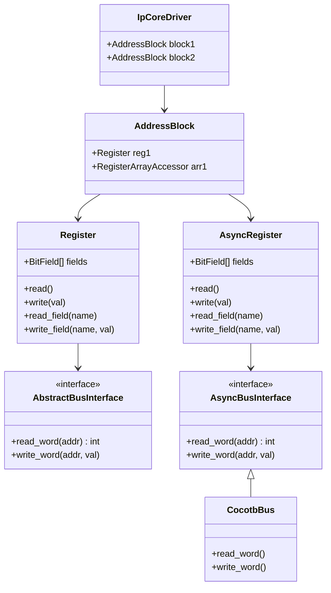

# Driver System

The driver system provides dynamically generated Python APIs for register
access in both simulation (cocotb) and hardware (JTAG, UART, PCIe)
environments.

## Design Principles

1. **Single Source of Truth** -- The driver is generated at runtime from the
   same `*.mm.yml` used for HDL generation. No manual driver code.
2. **Bus Abstraction** -- High-level register access is decoupled from the
   communication medium via abstract bus interfaces.
3. **Sync/Async Duality** -- The same memory map drives both synchronous
   (hardware scripts) and asynchronous (cocotb) register classes.

## Architecture



## Dynamic Construction

`load_driver(yaml_path, bus)` builds the driver hierarchy:

1. Parses the YAML memory map
2. Creates an `IpCoreDriver` root object
3. For each address block, creates an `AddressBlock` with computed offsets
4. For each register, creates `Register` or `AsyncRegister` with `BitField`
   definitions
5. Attaches objects via `setattr` for dot-notation access

Result: `driver.BLOCK_NAME.REGISTER_NAME.FIELD_NAME`

## Access Patterns

### Async API (Cocotb Simulation)

```python
from ipcraft.driver import load_driver, CocotbBus

bus = CocotbBus(dut, "s_axi", dut.clk)
driver = load_driver("core.mm.yml", bus)

# Register operations
val = await driver.REGS.CTRL.read()
await driver.REGS.CTRL.write(0x01)

# Field operations (read-modify-write)
await driver.REGS.CTRL.write_field("ENABLE", 1)
en = await driver.REGS.CTRL.read_field("ENABLE")

# Bound field syntax
val = await driver.REGS.CTRL.ENABLE.read()
await driver.REGS.CTRL.ENABLE.write(1)
```

### Sync API (Hardware Scripts)

```python
# With a synchronous bus backend (JTAG, UART, etc.)
driver = load_driver("core.mm.yml", jtag_bus, async_driver=False)

val = driver.REGS.CTRL.read()
driver.REGS.CTRL.write(0x01)
driver.REGS.CTRL.write_field("ENABLE", 1)
```

!!! warning
    Do not mix sync and async patterns. Use `AsyncRegister` with `await` in
    cocotb. Use `Register` without `await` for synchronous backends.

## Register Arrays

For registers defined with `count > 1`, the driver uses `RegisterArrayAccessor`
for lazy instantiation:

```yaml
registers:
  - name: LUT_ENTRY
    count: 64
    stride: 4
```

```python
# Registers are created on-demand when indexed
await driver.BLOCK.LUT_ENTRY[5].write(0xFF)
val = await driver.BLOCK.LUT_ENTRY[10].read_field("COEFF")
```

This avoids pre-allocating thousands of register objects for large arrays.

## Bus Backends

### CocotbBus

Built-in async bus for cocotb simulations. Supports:

- `bus_type="axil"` -- via `cocotbext-axi` AxiLiteMaster
- `bus_type="avmm"` -- via `cocotb-bus` AvalonMaster

```python
bus = CocotbBus(dut, "s_axi", dut.clk, reset=dut.rst_n, bus_type="axil")
```

Auto-detects reset signal if not explicitly provided.

### Custom Bus Backends

Implement `AbstractBusInterface` (sync) or `AsyncBusInterface` (async):

```python
from ipcraft.runtime.register import AbstractBusInterface

class JtagBus(AbstractBusInterface):
    def read_word(self, addr: int) -> int:
        # Your JTAG read implementation
        ...

    def write_word(self, addr: int, data: int) -> None:
        # Your JTAG write implementation
        ...
```

## BitField Operations

`BitField` handles bit manipulation:

- `mask` -- bitmask for the field
- `max_value` -- maximum representable value
- `extract_value(reg_val)` -- extract field from register value
- `insert_value(reg_val, field_val)` -- insert field into register value

Write-field operations use read-modify-write (RMW) internally, with special
handling for `write-1-to-clear` fields to avoid unintended bit clearing.

## Write-1-to-Clear (W1C) Handling

For fields with `write-1-to-clear` or `read-write-1-to-clear` access, the RMW
logic zeros out W1C fields in the mask to prevent accidental clearing:

```
RMW for normal field:   read -> modify target -> write back
RMW for W1C field:      read -> zero all W1C fields -> set target -> write
```
