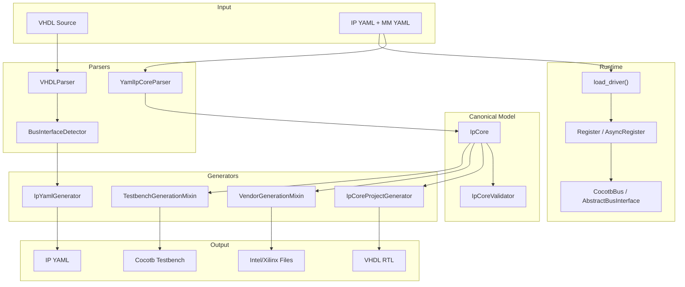

# Architecture Overview

## Design Principles

1. **Single Source of Truth** -- The YAML specification defines everything.
   All generators, parsers, and drivers consume or produce the canonical
   `IpCore` model.

2. **Canonical Model** -- The `IpCore` Pydantic model is the central data
   structure. Parsers produce it, generators consume it, validators check it.

3. **Mixin Composition** -- Complex classes are built from focused mixins
   rather than deep inheritance hierarchies.

4. **Strict/Flexible Duality** -- Top-level schema objects forbid unknown
   fields (`StrictModel`); memory map objects ignore them (`FlexibleModel`)
   to support vendor extensions.

5. **Sync/Async Duality** -- Runtime register access supports both synchronous
   (hardware scripts) and asynchronous (cocotb simulation) patterns.

## System Architecture



## Module Structure

```
ipcraft/
  model/         Pydantic data models (IpCore, MemoryMap, BusInterface, ...)
  parser/
    yaml/        YAML-to-IpCore parser with mixin architecture
    hdl/         VHDL parser and bus interface detector
  generator/
    hdl/         VHDL/vendor/testbench generation (Jinja2 templates)
    yaml/        IpCore-to-YAML generation (reverse of parser)
  runtime/       Register/BitField classes for hardware access
  driver/        Cocotb bus integration and dynamic driver loader
  utils/         Shared utilities (bus type normalization, bit parsing)
  cli.py         Command-line interface (argparse)
```

## Data Flow

### Parse Flow (VHDL to YAML)

1. `VHDLParser` extracts entity ports, generics, and architecture from VHDL
   using pyparsing grammar (with regex fallback).
2. `BusInterfaceDetector` groups ports by prefix and matches against bus
   library definitions (>=70% required port match threshold).
3. `IpYamlGenerator` assembles clocks, resets, ports, bus interfaces, and
   parameters into a YAML structure.

### Generate Flow (YAML to VHDL)

1. `YamlIpCoreParser` loads the IP YAML, resolves imports (memory maps,
   filesets), and constructs the `IpCore` model.
2. `IpCoreValidator` checks semantic correctness (address overlap, reference
   integrity, naming uniqueness).
3. `IpCoreProjectGenerator` builds a Jinja2 template context from the model
   and renders VHDL files.
4. `VendorGenerationMixin` produces Intel `_hw.tcl` and Xilinx `component.xml`.
5. `TestbenchGenerationMixin` generates cocotb test files and simulation
   Makefiles.

### Driver Flow (YAML to Python API)

1. `load_driver()` parses the `*.mm.yml` file.
2. Constructs `IpCoreDriver` with `AddressBlock` and `Register`/`AsyncRegister`
   instances attached via `setattr`.
3. Result is a dot-notation API: `driver.BLOCK.REGISTER.FIELD.read()`.

## Key Patterns

### Mixin Architecture

The generator and parser use mixin composition:

```
IpCoreProjectGenerator
  extends BaseGenerator (abstract: generate_package, generate_top, ...)
  mixes in VendorGenerationMixin (Intel/Xilinx files)
  mixes in TestbenchGenerationMixin (cocotb files)
  mixes in FileSetManagerMixin (fileset tracking)

YamlIpCoreParser
  mixes in MemoryMapParserMixin (register/address block parsing)
  mixes in FileSetParserMixin (fileset import handling)
```

### Model Validation

Two-tier validation:

1. **Pydantic** -- Field types, required fields, enum values
2. **IpCoreValidator** -- Semantic rules: address alignment, reference
   integrity, register overlap, naming uniqueness

### Template Rendering

All HDL generation uses Jinja2 templates stored in
`ipcraft/generator/hdl/templates/`. The generator builds a context dictionary
from the `IpCore` model and passes it to templates.
