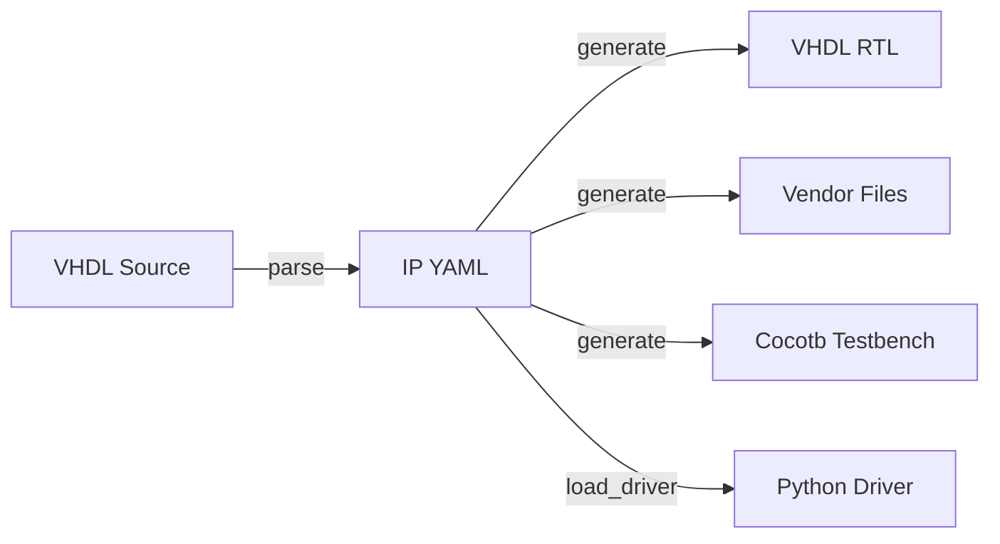

# IPCraft

Python library and CLI for FPGA IP Core development and VHDL generation.

IPCraft provides a complete workflow for defining, parsing, generating, and
validating IP cores using a YAML-based specification format.

## What is IPCraft?

IPCraft bridges the gap between IP core specification and HDL implementation.
It treats a YAML file as the **single source of truth** for an IP core and
automates the generation of:

- VHDL packages, entities, and bus wrappers
- Vendor integration files (Intel Platform Designer, Xilinx Vivado)
- Cocotb testbenches with register driver support
- Python runtime drivers for simulation and hardware access

## Key Features

- **Parse** -- Extract IP core definitions from existing VHDL source files with
  automatic bus interface detection (AXI4-Lite, AXI-Stream, Avalon-MM).
- **Generate** -- Produce VHDL, vendor integration files, and testbenches from
  YAML definitions.
- **Bus Library** -- Standard bus interface definitions with port-level detail.
- **Runtime Drivers** -- Dynamically generated Python register drivers from the
  same YAML memory map used for HDL generation.
- **Validation** -- Semantic validation of IP core definitions (address
  alignment, reference integrity, naming uniqueness).

## Workflow



## Quick Example

```bash
# Parse existing VHDL to YAML specification
ipcraft parse my_core.vhd

# Generate VHDL and vendor files from YAML
ipcraft generate my_core.ip.yml --output ./build

# List available bus types
ipcraft list-buses
```

## Next Steps

- [Installation](getting-started/installation.md) -- Set up IPCraft
- [Quick Start](getting-started/quickstart.md) -- Build your first IP core
- [CLI Reference](user-guide/cli.md) -- Full command documentation
- [IP YAML Specification](user-guide/ip-yaml-spec.md) -- YAML format reference
