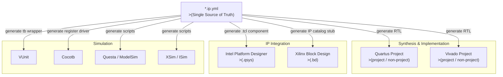

# Unified FPGA Workflow

This document proposes a **vendor-agnostic, tool-agnostic FPGA development workflow**
built around IPCraft. The goal is a single, reproducible process that maps to the
native toolchain of any target vendor — without rewriting scripts from scratch every
time you switch between Intel Quartus and AMD Vivado.

---

## Core Concept: YAML as the Single Source of Truth

Every IP core starts as a YAML specification (`*.ip.yml`). IPCraft turns that
spec into everything else: RTL, vendor integration stubs, testbench wrappers,
Python register drivers. The workflow phases below all feed from this single
artifact.



---

## Directory Layout

A project following this workflow uses a predictable structure:

```
my_project/
├── ip/
│   └── my_core/
│       ├── my_core.ip.yml       # IPCraft spec
│       └── rtl/
│           ├── my_core_pkg.vhd  # generated
│           └── my_core.vhd      # generated or hand-written
├── sim/
│   ├── vunit/
│   │   └── run.py               # VUnit test runner
│   ├── cocotb/
│   │   ├── test_my_core.py      # Cocotb test
│   │   └── Makefile
│   └── questa/
│       └── wave.do
├── synth/
│   ├── quartus/
│   │   ├── project.qpf          # (project mode)
│   │   ├── project.qsf
│   │   └── scripts/
│   │       └── build.tcl        # (non-project mode)
│   └── vivado/
│       ├── project.xpr          # (project mode)
│       └── scripts/
│           └── build.tcl        # (non-project mode)
├── integration/
│   ├── platform_designer/
│   │   └── system.qsys
│   └── block_design/
│       └── system.bd
└── Makefile                     # Unified entry point
```

---

## Phase 1 — IP Specification

Define or update the IP core YAML. This is the only file you edit by hand for a
new peripheral.

```bash
# Bootstrap a new core
ipcraft new my_core --bus AXI4_LITE

# Or parse existing VHDL to generate the YAML
ipcraft parse rtl/my_core.vhd
```

Validate the spec at any time:

```bash
ipcraft validate ip/my_core/my_core.ip.yml
```

---

## Phase 2 — RTL Generation

```bash
ipcraft generate ip/my_core/my_core.ip.yml --output ip/my_core/rtl
```

This produces:
- `my_core_pkg.vhd` — constants, types, register map
- `my_core.vhd` — entity with bus wrapper

---

## Phase 3 — Simulation

### 3a. VUnit

VUnit provides a Python test runner that works with GHDL, ModelSim/Questa, and
Riviera-PRO. It is the recommended methodology for pure-VHDL testbenches.

**`sim/vunit/run.py`:**

```python
from vunit import VUnit

vu = VUnit.from_argv()
lib = vu.add_library("lib")
lib.add_source_files("../../ip/my_core/rtl/*.vhd")
lib.add_source_files("tb_my_core.vhd")
vu.main()
```

Run:

```bash
python sim/vunit/run.py --simulator ghdl        # open-source
python sim/vunit/run.py --simulator modelsim    # Questa / ModelSim
python sim/vunit/run.py -p4                     # parallel jobs
```

VUnit automatically discovers `tb_*` entities and `run` processes tagged with
`runner_cfg`. See the [VUnit documentation](https://vunit.github.io) for details.

---

### 3b. Cocotb

Cocotb lets you write testbenches in Python with coroutine-based stimulus. IPCraft
generates a register driver from the same YAML memory map, so you can drive
registers without hardcoding addresses.

**`sim/cocotb/test_my_core.py`:**

```python
import cocotb
from cocotb.clock import Clock
from cocotb.triggers import RisingEdge
from ipcraft.runtime import load_driver

@cocotb.test()
async def test_register_write(dut):
    cocotb.start_soon(Clock(dut.clk, 10, units="ns").start())
    driver = load_driver("../../ip/my_core/my_core.ip.yml", dut)
    await driver.reset()
    await driver.ctrl.write(0x1)
    await RisingEdge(dut.clk)
    assert await driver.ctrl.read() == 0x1
```

**`sim/cocotb/Makefile`:**

```makefile
TOPLEVEL_LANG = vhdl
VHDL_SOURCES  = $(wildcard ../../ip/my_core/rtl/*.vhd)
TOPLEVEL      = my_core
MODULE        = test_my_core
SIM           ?= ghdl          # override: make SIM=questa

include $(shell cocotb-config --makefiles)/Makefile.sim
```

Supported simulators: `ghdl`, `questa`, `modelsim`, `xcelium`, `riviera`, `icarus`.

---

### 3c. Questa / ModelSim (standalone)

For waveform-centric debugging or when a project mandates a Questa-only flow:

**`sim/questa/compile.do`:**

```tcl
vlib work
vmap work work

vcom -2008 ../../ip/my_core/rtl/my_core_pkg.vhd
vcom -2008 ../../ip/my_core/rtl/my_core.vhd
vcom -2008 tb_my_core.vhd

vsim -t 1ns work.tb_my_core
do wave.do
run -all
```

---

### 3d. XSim (Vivado Integrated Simulator)

XSim is tightly coupled to the Vivado project. In non-project mode, invoke it
from the Vivado TCL console or a script:

```tcl
# inside vivado -mode tcl
xvhdl --2008 ip/my_core/rtl/my_core_pkg.vhd
xvhdl --2008 ip/my_core/rtl/my_core.vhd
xvhdl --2008 sim/xsim/tb_my_core.vhd
xelab -debug all work.tb_my_core -s sim_snapshot
xsim sim_snapshot -runall
```

---

## Phase 4 — Synthesis

### 4a. Intel Quartus

#### Project mode

Quartus stores all settings in a `.qsf` file. IPCraft-generated RTL is added like
any other HDL source:

**`synth/quartus/project.qsf` (excerpt):**

```tcl
set_global_assignment -name FAMILY "Cyclone V"
set_global_assignment -name DEVICE 5CSEBA6U23I7
set_global_assignment -name TOP_LEVEL_ENTITY top
set_global_assignment -name VHDL_FILE ../../ip/my_core/rtl/my_core_pkg.vhd
set_global_assignment -name VHDL_FILE ../../ip/my_core/rtl/my_core.vhd
set_global_assignment -name VHDL_FILE rtl/top.vhd
```

Open project: `quartus synth/quartus/project.qpf`

#### Non-project mode

No `.qpf` is created; everything happens in TCL:

**`synth/quartus/scripts/build.tcl`:**

```tcl
package require ::quartus::flow

set_global_assignment -name FAMILY "Cyclone V"
set_global_assignment -name DEVICE 5CSEBA6U23I7
set_global_assignment -name TOP_LEVEL_ENTITY top
set_global_assignment -name VHDL_FILE ../../ip/my_core/rtl/my_core_pkg.vhd
set_global_assignment -name VHDL_FILE ../../ip/my_core/rtl/my_core.vhd
set_global_assignment -name VHDL_FILE rtl/top.vhd

execute_flow -compile
```

Run: `quartus_sh -t synth/quartus/scripts/build.tcl`

---

### 4b. AMD Vivado

#### Project mode

**`synth/vivado/scripts/create_project.tcl`:**

```tcl
create_project my_project ./vivado_project -part xc7a35tcpg236-1

set_property target_language VHDL [current_project]

add_files {
    ../../ip/my_core/rtl/my_core_pkg.vhd
    ../../ip/my_core/rtl/my_core.vhd
    rtl/top.vhd
}

update_compile_order -fileset sources_1
```

Run once to create the `.xpr`: `vivado -mode tcl -source scripts/create_project.tcl`

Afterwards open interactively: `vivado synth/vivado/vivado_project/my_project.xpr`

#### Non-project mode

Non-project mode avoids the `.xpr` entirely — ideal for CI and reproducible builds:

**`synth/vivado/scripts/build.tcl`:**

```tcl
read_vhdl -vhdl2008 {
    ../../ip/my_core/rtl/my_core_pkg.vhd
    ../../ip/my_core/rtl/my_core.vhd
    rtl/top.vhd
}
read_xdc constraints/timing.xdc

synth_design -top top -part xc7a35tcpg236-1
opt_design
place_design
route_design
write_bitstream -force output/top.bit
```

Run: `vivado -mode batch -source synth/vivado/scripts/build.tcl`

---

## Phase 5 — IP Integration

### 5a. Intel Platform Designer (Qsys)

IPCraft generates a `.tcl` registration script so your core appears in the
Platform Designer component library:

```bash
ipcraft generate ip/my_core/my_core.ip.yml --target platform_designer \
    --output integration/platform_designer
```

This creates `my_core_hw.tcl`. Register it in Quartus settings:

```tcl
# project.qsf
set_global_assignment -name IP_SEARCH_PATHS ../integration/platform_designer
```

Then open Platform Designer, find `my_core` in the IP catalog, and wire it into
your system. Export the resulting `system.qsys` and include the generated HDL in
your Quartus build.

---

### 5b. AMD Vivado Block Design

IPCraft generates an IP catalog packaging script for Vivado:

```bash
ipcraft generate ip/my_core/my_core.ip.yml --target vivado_ip \
    --output integration/block_design
```

Package and register in Vivado:

```tcl
# In Vivado TCL console
ipx::open_core integration/block_design/component.xml
set_property ip_repo_paths {integration/block_design} [current_project]
update_ip_catalog

# Then create block design
create_bd_design "system"
create_bd_cell -type ip -vlnv {bleviet:ipcraft:my_core:1.0} my_core_0
```

---

## Phase 6 — Unified Makefile

A top-level `Makefile` provides a single entry point regardless of the active
tool chain:

```makefile
CORE    ?= my_core
VENDOR  ?= quartus          # quartus | vivado
SIM     ?= ghdl             # ghdl | questa | cocotb
MODE    ?= nonproj          # project | nonproj

.PHONY: spec generate sim synth clean

spec:
	ipcraft validate ip/$(CORE)/$(CORE).ip.yml

generate:
	ipcraft generate ip/$(CORE)/$(CORE).ip.yml --output ip/$(CORE)/rtl

sim: generate
ifeq ($(SIM),cocotb)
	$(MAKE) -C sim/cocotb SIM=$(SIM)
else ifeq ($(SIM),questa)
	vsim -c -do sim/questa/compile.do
else
	python sim/vunit/run.py --simulator $(SIM) -p4
endif

synth: generate
ifeq ($(VENDOR),quartus)
ifeq ($(MODE),project)
	quartus_sh --flow compile synth/quartus/project.qpf
else
	quartus_sh -t synth/quartus/scripts/build.tcl
endif
else ifeq ($(VENDOR),vivado)
ifeq ($(MODE),project)
	vivado -mode tcl -source synth/vivado/scripts/create_project.tcl
else
	vivado -mode batch -source synth/vivado/scripts/build.tcl
endif
endif

clean:
	rm -rf ip/$(CORE)/rtl build/ db/ incremental_db/ .Xil/
```

Usage examples:

```bash
make sim SIM=ghdl
make sim SIM=cocotb
make synth VENDOR=quartus MODE=nonproj
make synth VENDOR=vivado MODE=project
```

---

## Phase 7 — CI/CD Integration

### GitHub Actions example

```yaml
# .github/workflows/fpga.yml
name: FPGA CI

on: [push, pull_request]

jobs:
  validate:
    runs-on: ubuntu-latest
    steps:
      - uses: actions/checkout@v4
      - uses: actions/setup-python@v5
        with: { python-version: "3.11" }
      - run: pip install ipcraft
      - run: make spec

  simulate:
    runs-on: ubuntu-latest
    needs: validate
    steps:
      - uses: actions/checkout@v4
      - run: sudo apt-get install -y ghdl
      - run: pip install vunit-hdl cocotb
      - run: make sim SIM=ghdl

  synthesize:
    runs-on: self-hosted          # requires licensed EDA tools
    needs: simulate
    steps:
      - uses: actions/checkout@v4
      - run: make synth VENDOR=vivado MODE=nonproj
      - uses: actions/upload-artifact@v4
        with:
          name: bitstream
          path: output/*.bit
```

---

## Workflow Summary

| Phase | Command | Vendor agnostic? |
|-------|---------|-----------------|
| Validate spec | `make spec` | ✅ |
| Generate RTL | `make generate` | ✅ |
| Simulate (VUnit) | `make sim SIM=ghdl` | ✅ |
| Simulate (Cocotb) | `make sim SIM=cocotb` | ✅ |
| Simulate (Questa) | `make sim SIM=questa` | ✅ |
| Simulate (XSim) | _Vivado TCL_ | ❌ Vivado only |
| Synthesize (Quartus) | `make synth VENDOR=quartus` | ❌ Intel only |
| Synthesize (Vivado) | `make synth VENDOR=vivado` | ❌ AMD only |
| IP Integration (PD) | _Quartus IP search path_ | ❌ Intel only |
| IP Integration (BD) | _Vivado IP catalog_ | ❌ AMD only |

---

## Open Questions / Next Steps

The following items are candidates for future iteration:

- [ ] **Synthesis targets** — Add support for Gowin, Lattice (nextpnr / Diamond)
- [ ] **Simulation methodology** — Formalise VUnit vs Cocotb decision criteria
- [ ] **IPCraft CLI** — `ipcraft synth` and `ipcraft sim` sub-commands to wrap the Makefile targets
- [ ] **Intel Platform Designer** — Formalise `.tcl` generation from YAML (IP component interface)
- [ ] **Xilinx Block Design** — Formalise `component.xml` / IP-XACT generation
- [ ] **Non-project mode** — Evaluate incremental compilation support (both vendors)
- [ ] **Constraints** — Unified constraint flow (SDC for Quartus, XDC for Vivado)
- [ ] **IP-XACT** — Evaluate IEEE 1685 as a portable integration format above vendor-specific wrappers
