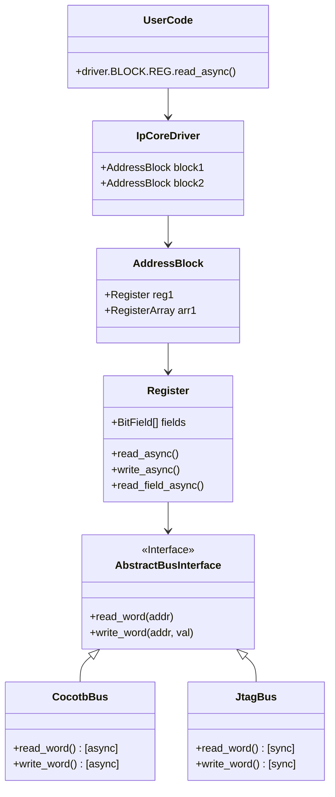

# Python Driver Architecture

## Overview

The IP Core Driver architecture is designed to provide a unified, dynamically generated Python API for interacting with FPGA IP cores. It decouples high-level register access logic from the low-level communication medium, allowing the same driver code to be used in:

1.  **Simulation:** With Cocotb (Asynchronous).
2.  **Hardware Validation:** Via JTAG, UART, or PCIe (Synchronous).
3.  **Software Integration:** As part of a larger PYNQ or embedded Linux application.

## Core Design Principles

### 1. Single Source of Truth
The driver is not written manually. It is **dynamically constructed at runtime** by parsing the same YAML memory map (`*.mm.yml`) used to generate the HDL register bank. This eliminates skew between software and hardware definitions.

### 2. Abstraction Layers

### 3. Dynamic Construction (`loader.py`)

The `load_driver(yaml_path, bus)` function:
1.  Parses the YAML memory map.
2.  Instantiates an root `IpCoreDriver`.
3.  Iterates through address blocks and registers.
4.  Attaches `AddressBlock` and `Register` objects to the hierarchy using `setattr`.
5.  Calculates absolute addresses based on block offsets.

This results in a natural dot-notation API: `driver.BLOCK_NAME.REGISTER_NAME`.

## Sync vs Async Strategy

One of the biggest architectural challenges is supporting both sync (hardware) and async (simulation) environments with a single codebase.

### The "Dual API" Solution

The `Register` class implements both APIs on the same object:

1.  **Explicit Async Methods (`*_async`)**:
    *   Designed for **Cocotb**.
    *   These methods invoke the bus interface and check if the result is awaitable (a coroutine). If so, they `await` it.
    *   Use `read_field_async("NAME")` for read-modify-write operations on fields.

2.  **Property Access (`reg.field`)**:
    *   Designed for **Hardware Scripts**.
    *   Uses a `FieldProperty` proxy object to intercept attribute access (`__getattr__`).
    *   `reg.field = 1` triggers an immediate read-modify-write.
    *   **Limitation:** This syntax is incompatible with async backends because property setters cannot be `await`ed in Python.

## Register Arrays

For memory efficiency, huge register arrays (e.g., lookup tables) uses `RegisterArrayAccessor`.
*   It does **not** pre-generate thousands of Register objects.
*   It implements `__getitem__`.
*   A `Register` object is created **on-demand** only when a specific index is accessed (`driver.LUT[5]`).

## Module Structure

| Module | Location | Responsibility |
|--------|----------|----------------|
| **Loader** | `ipcraft.driver.loader` | Parsing YAML, building object hierarchy. |
| **Bus** | `ipcraft.driver.bus` | Concrete bus implementations (e.g., `CocotbBus`). |
| **Runtime**| `ipcraft.runtime.register`| Generic `Register`, `BitField`, `AddressBlock` classes. |

## Future Extensions

*   **Shadow Registers:** Implementation of a caching layer to batch writes for slow buses (JTAG).
*   **Virtual Registers:** Defining higher-level logical registers that map to multiple physical addresses.
