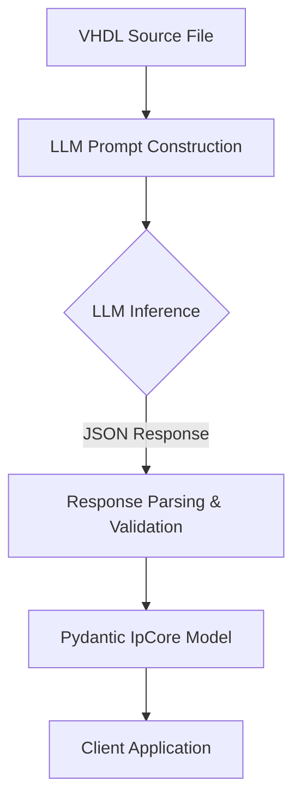

# AI VHDL Parser - Architecture & Design

## Overview

The AI VHDL Parser (`vhdl_ai_parser.py`) represents a shift from traditional rigid grammar-based parsing to a **pure LLM-based architecture**. It uses Large Language Models to interpret VHDL code, extracting structured data (entity, ports, generics) and automatically detecting bus interfaces.

## Architectural Evolution

### Why We Migrated from "Hybrid" to "Pure LLM"

Previously, the parser used a "Hybrid" approach:
1.  **Phase 1 (Pyparsing):** Deterministic grammar to extract the entity structure.
2.  **Phase 2 (LLM):** Optional AI analysis to detect bus interfaces.

**Problems with Hybrid:**
*   **Brittle Grammar:** VHDL's syntax is complex. The grammar failed on edge cases like nested parentheses or complex arithmetic in port widths (e.g., `(WIDTH/8)-1`).
*   **Maintenance Burden:** Maintaining a BNF-like grammar for VHDL requires significant effort.
*   **Disjointed Experience:** AI features were optional, leading to two code paths.

### Pure LLM Architecture (Current)

We removed `pyparsing` entirely. The new architecture is a single-stage pipeline:

**Benefits:**
*   **Robustness:** LLMs "understand" code semantics and handle complex expressions/formatting naturally.
*   **Simplicity:** Codebase reduced by ~20% (-177 lines). No grammar maintenance.
*   **Always-on Intelligence:** Bus detection and documentation generation are native features, not addons.

---

## Capabilities & Prompts

The core of the parser is a carefully engineered system prompt that instructs the LLM to act as a structured data extractor.

### 1. Complex Expression Handling
The LLM is explicitly instructed to evaluate arithmetic expressions for port widths.
*   **Input:** `input : std_logic_vector((WIDTH/8)-1 downto 0)`
*   **LLM Output:** `width: 4` (assuming WIDTH generic default is 32)
*   *Legacy parsers would crash here due to parenthesis nesting.*

### 2. Automatic Bus Interface Detection
The parser identifies standard bus interfaces (AXI4-Lite, AXI-Stream, Avalon-MM, Wishbone) using 3 cues:
1.  **Prefix Pattern:** `s_axi_awaddr`, `m_axis_tdata`
2.  **Signal Composition:** Presence of standardized signals (e.g., `ack_o`, `cyc_i`, `stb_i` implies Wishbone).
3.  **Semantic Comments:** Parsing comments like `-- AXI4-Lite Slave Interface`.

### 3. Documentation Generation
Using the semantic understanding of the entity name and ports, the LLM generates a human-readable description of the core automatically.

---

## Implementation Details

### Data Models
We use **Pydantic** for all data structures (`ipcraft.model.*`). This ensures that the unstructured JSON returned by the LLM is strictly validated before being used.

### Provider Abstraction
The parser supports multiple LLM backends via the `llm_core` pattern:
*   **Ollama:** Recommended for local, privacy-preserving parsing (e.g., `llama3`, `gemma`).
*   **OpenAI / Gemini:** Supported for cloud-based parsing.

### Performance & Trade-offs

| Metric | Rigid Grammar | Pure LLM |
|--------|---------------|----------|
| **Speed** | Fast (~50ms) | Slow (~2-30s depending on model) |
| **Robustness** | Brittle (grammar errors) | High (semantic understanding) |
| **Logic** | None | Bus Inference, Code understanding |
| **Dependencies** | pyparsing | LLM Provider (local or API) |

**Decision:** For a scaffolding and generation tool, **reliability and intelligence** are more critical than raw parsing speed. The trade-off is accepted.

---

## Future Roadmap

1.  **Caching:** Implement hash-based caching of VHDL files to avoid re-parsing unchanged files.
2.  **Architecture Parsing:** Extend parsing to the `architecture` body to infer clock domains or internal topology.
3.  **Multi-Entity Support:** Handle files containing multiple entity definitions or packages.
4.  **IP-XACT Export:** Add direct export to standard IP-XACT XML format.
